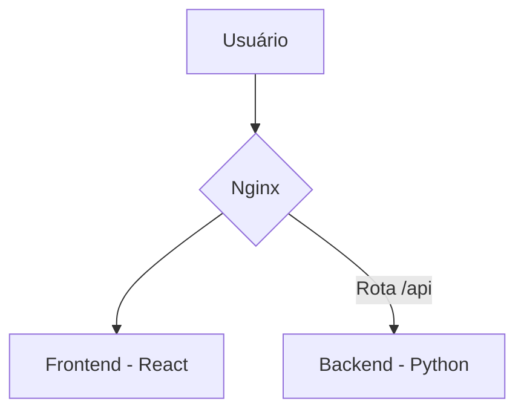
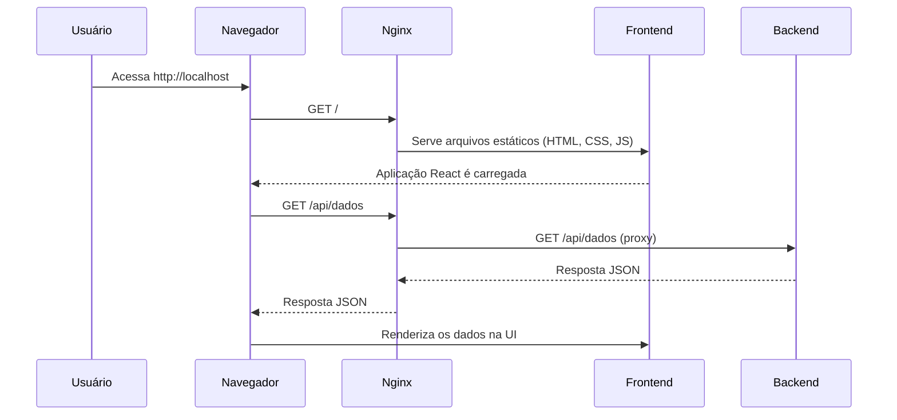

# Documentação Técnica do Projeto

Este documento fornece uma visão geral técnica da aplicação, detalhando sua arquitetura, funcionalidades e como executar o ambiente de desenvolvimento localmente.

## 1. Ambiente de Desenvolvimento Local

A aplicação é totalmente containerizada utilizando Docker e Docker Compose, o que simplifica a configuração do ambiente de desenvolvimento. Para executar a aplicação, siga os passos abaixo:

**Pré-requisitos:**
*   [Docker](https://docs.docker.com/get-docker/) instalado e em execução.
*   [Docker Compose](https://docs.docker.com/compose/install/) instalado.

**Passos para Execução:**

1.  **Clone o Repositório:**
    ```bash
    git clone https://github.com/matheusfly/landing-page-base-gym.git
    cd landing-page-base-gym
    ```

2.  **Inicie os Contêineres:**
    Execute o comando a seguir na raiz do projeto para construir as imagens e iniciar os serviços do frontend e backend.
    ```bash
    docker-compose up --build
    ```
    O comando irá baixar as dependências, construir as imagens Docker e iniciar os contêineres em modo "attached", exibindo os logs em tempo real.

3.  **Acesse a Aplicação:**
    Após a conclusão do processo, a aplicação estará disponível no seu navegador através do seguinte endereço:
    [http://localhost](http://localhost)

## 2. Arquitetura do Sistema

A arquitetura da aplicação é baseada em uma separação clara entre o frontend e o backend, ambos executando em contêineres Docker independentes e orquestrados pelo Docker Compose.

### Componentes Principais:

*   **Frontend:**
    *   **Tecnologia:** Aplicação [React](https://reactjs.org/) criada com [Vite](https://vitejs.dev/).
    *   **Servidor Web:** O build estático da aplicação React é servido por um contêiner [Nginx](https://www.nginx.com/).
    *   **Responsabilidade:** Interface do usuário, interação com o cliente e renderização de componentes visuais.

*   **Backend:**
    *   **Tecnologia:** API RESTful desenvolvida em Python com o framework [Flask](https://flask.palletsprojects.com/).
    *   **Responsabilidade:** Lógica de negócio, processamento de dados e comunicação com futuras fontes de dados (bancos de dados, serviços externos, etc.).
    *   **Endpoint:** A API é executada internamente na porta `5000`.

*   **Nginx (Proxy Reverso):**
    *   O Nginx, além de servir os arquivos estáticos do frontend, atua como um **proxy reverso**.
    *   Todas as requisições feitas pelo frontend para o caminho `/api` são redirecionadas para o serviço de backend (`http://backend:5000`). Isso simplifica a comunicação entre os serviços e evita problemas com CORS (Cross-Origin Resource Sharing), pois para o navegador, todas as requisições parecem vir da mesma origem.

*   **Docker & Docker Compose:**
    *   **Docker:** Garante que cada serviço (frontend e backend) execute em um ambiente isolado e consistente, com todas as suas dependências empacotadas.
    *   **Docker Compose:** Orquestra a inicialização e a comunicação entre os contêineres, definindo a rede interna e a ordem de inicialização dos serviços.

## 3. Diagramas da Arquitetura

Esta seção ilustra visualmente a arquitetura do sistema e o fluxo de dados entre os componentes.

### Diagrama de Componentes

O diagrama abaixo mostra os principais componentes da aplicação e como eles se interagem.



### Diagrama de Fluxo de Requisição

Este diagrama de sequência detalha o fluxo de uma requisição desde o navegador do usuário até o backend e vice-versa.



**Exemplo de Fluxo de Requisição:**
1.  O usuário acessa `http://localhost` no navegador.
2.  O Nginx recebe a requisição e serve o arquivo `index.html` da aplicação React.
3.  A aplicação React é carregada no navegador e realiza uma chamada para `/api/dados`.
4.  O Nginx intercepta a requisição para `/api/dados` e a encaminha para o serviço de backend em `http://backend:5000/api/dados`.
5.  O backend processa a requisição e retorna os dados para o Nginx.
6.  O Nginx repassa a resposta para o frontend, que a utiliza para renderizar as informações na tela.
